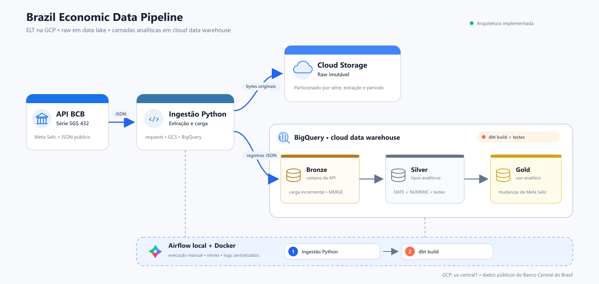
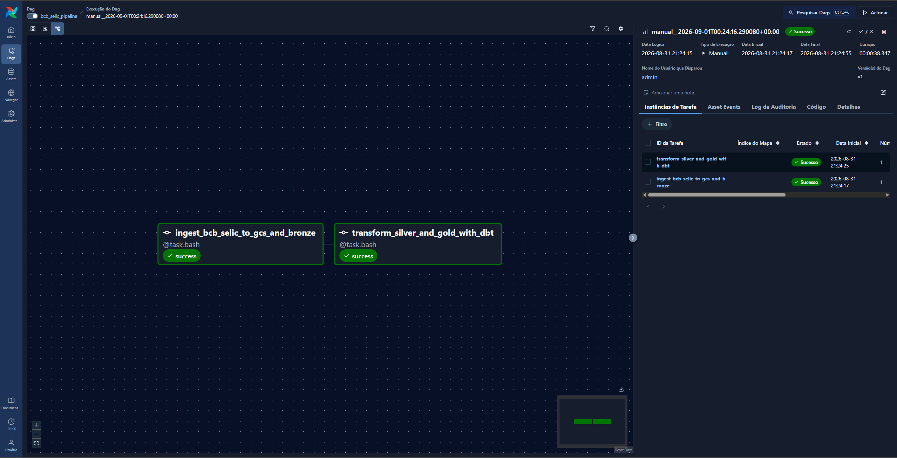
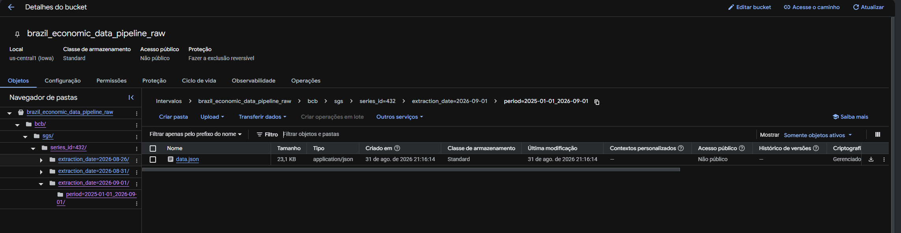
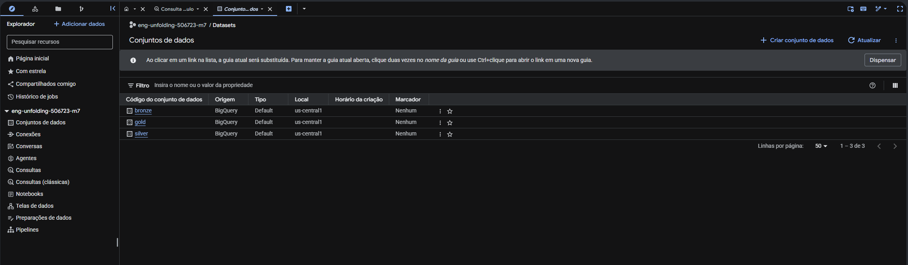
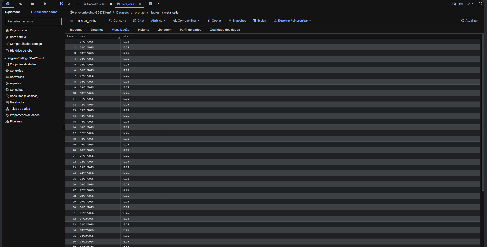
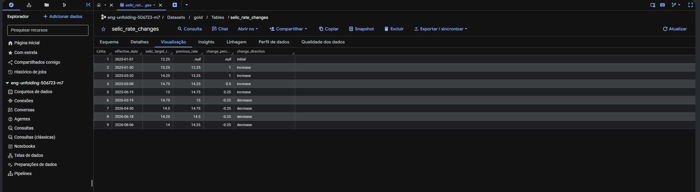

# Brazil Economic Data Pipeline

Pipeline ELT para coleta, armazenamento e transformação de indicadores econômicos brasileiros utilizando serviços do Google Cloud.


## Visão geral

Este projeto de portfólio foi desenvolvido com foco no aprendizado de engenharia de dados em nuvem e no entendimento prático das responsabilidades de um **data lake** e de um **cloud data warehouse**.

A pipeline coleta a série 432 do Sistema Gerenciador de Séries Temporais do Banco Central do Brasil, correspondente à Meta Selic. A resposta original é preservada no Cloud Storage, enquanto os registros são carregados no BigQuery e transformados com dbt nas camadas bronze, silver e gold.

O projeto combina:

- armazenamento raw imutável em um data lake;
- processamento analítico em um cloud data warehouse;
- transformações ELT e testes com dbt;
- carga incremental e idempotente na bronze;
- orquestração local e manual com Airflow e Docker;
- preocupação com custos, segurança de credenciais e reprocessamento.

> Esta arquitetura não é um lakehouse. O Cloud Storage atua como camada raw do data lake e o BigQuery concentra as tabelas analíticas do data warehouse.

## Arquitetura



O arquivo vetorial editável está disponível em [`docs/architecture/pipeline-architecture.svg`](docs/architecture/pipeline-architecture.svg).

### Fluxo dos dados

1. A ingestão Python consulta a API pública do BCB para o período iniciado em 1º de janeiro de 2025.
2. Os bytes originais da resposta são enviados ao Cloud Storage antes de qualquer transformação.
3. A mesma resposta é convertida em registros JSON e carregada em uma tabela staging no BigQuery.
4. Um `MERGE` insere datas novas e atualiza valores revisados na tabela bronze.
5. O dbt converte os tipos na silver e produz o histórico de mudanças da taxa na gold.
6. O Airflow executa a ingestão antes do `dbt build` e centraliza status, tentativas e logs.

O BigQuery não é carregado a partir do arquivo do GCS nesta versão. A ingestão Python cria duas saídas a partir da mesma resposta: uma cópia raw no data lake e uma carga estruturada na bronze.

## Pergunta de negócio

O modelo gold busca responder:

> Quando a Meta Selic mudou, qual era a taxa anterior e qual foi a direção e a magnitude da alteração?

A tabela `gold.selic_rate_changes` contém:

- data em que o novo valor passou a aparecer na série;
- Meta Selic vigente;
- taxa anterior;
- mudança em pontos percentuais;
- direção da mudança: `initial`, `increase` ou `decrease`.

## Camadas de dados

| Camada | Tecnologia | Objeto | Responsabilidade |
|---|---|---|---|
| Raw | Cloud Storage | `bcb/sgs/series_id=432/.../data.json` | Preservar a resposta original de forma imutável e particionada. |
| Bronze | BigQuery | `bronze.meta_selic` | Manter os campos `data` e `valor` próximos do formato recebido da API. |
| Silver | BigQuery + dbt | `silver.meta_selic` | Converter data e taxa para tipos analíticos adequados. |
| Gold | BigQuery + dbt | `gold.selic_rate_changes` | Expor somente os marcos de mudança da Meta Selic. |

Durante a carga incremental, `bronze.meta_selic_staging` existe apenas de forma transitória e é removida depois de um `MERGE` bem-sucedido.

## Decisões de arquitetura

### Airflow local com Docker

O Airflow é executado localmente e acionado manualmente. Essa decisão permite aprender DAGs, dependências, retries e observabilidade sem manter uma VM, um cluster ou um ambiente Cloud Composer continuamente ativo.

O modo `standalone` é adequado para desenvolvimento e demonstração, mas não representa uma implantação de produção. Em um cenário produtivo, seria necessário avaliar autenticação, banco de metadados, executor, monitoramento, alta disponibilidade e um ambiente gerenciado ou dedicado.

### Raw imutável

O upload para o GCS utiliza uma precondição de geração. Se o objeto já existir no mesmo caminho, ele não é sobrescrito. O caminho registra fonte, série, data de extração e período consultado:

```text
bcb/sgs/
└── series_id=432/
    └── extraction_date=YYYY-MM-DD/
        └── period=YYYY-MM-DD_YYYY-MM-DD/
            └── data.json
```

### Bronze incremental e idempotente

Cada execução substitui somente a tabela staging. A tabela final utiliza a data como chave do `MERGE`:

- data inexistente: `INSERT`;
- data existente com valor revisado: `UPDATE`;
- data e valor iguais: nenhuma alteração.

Isso permite reprocessar o período sem criar duplicatas na bronze.

### Transformações no warehouse

As transformações ficam no dbt e são executadas dentro do BigQuery. A ingestão não aplica regras analíticas aos dados raw. Para o volume atual, silver e gold são materializadas como tabelas, priorizando clareza e simplicidade.

### Escopo reduzido

A primeira versão utiliza apenas uma série do BCB. A escolha foi intencional: concluir um fluxo ponta a ponta antes de adicionar novas fontes, dashboards, infraestrutura como código ou CI/CD.

## Qualidade dos dados

O comando `dbt build` cria os modelos e executa testes de qualidade.

Na silver:

- `reference_date`: `not_null` e `unique`;
- `selic_target_rate`: `not_null`.

Na gold:

- `effective_date`: `not_null` e `unique`;
- `selic_target_rate`: `not_null`;
- `change_direction`: `not_null` e valores aceitos (`initial`, `increase`, `decrease`).

## Estrutura do repositório

```text
.
├── dags/
│   └── bcb_selic_pipeline.py
├── docs/
│   ├── architecture/
│   │   └── pipeline-architecture.svg
│   └── images/
├── src/
│   └── ingestion/
│       └── bcb_meta_selic.py
├── brazil_economic_data/
│   ├── macros/
│   │   └── generate_schema_name.sql
│   ├── models/
│   │   ├── silver/
│   │   └── gold/
│   ├── dbt_project.yml
│   └── profiles.example.yml
├── .env.example
├── docker-compose.yml
├── Dockerfile
└── requirements.txt
```

## Pré-requisitos

- Git;
- Docker Desktop com contêineres Linux;
- Google Cloud CLI (`gcloud` e `bq`);
- projeto no Google Cloud com faturamento habilitado;
- bucket no Cloud Storage;
- datasets `bronze`, `silver` e `gold` no BigQuery.

Python local é necessário apenas para desenvolvimento fora do Docker. A imagem utilizada pelo projeto já contém Airflow 3.3.1 e Python 3.14.

## Configuração do Google Cloud

Todos os recursos deste projeto foram mantidos em `us-central1` para simplificar a arquitetura e evitar movimentação desnecessária entre regiões.

Antes da execução:

1. Crie um projeto no Google Cloud e associe uma conta de faturamento.
2. Configure um orçamento e alertas de cobrança.
3. Crie um bucket Standard, não público, em `us-central1`.
4. Crie os datasets `bronze`, `silver` e `gold` na mesma região.
5. Garanta que a identidade utilizada tenha permissão para gravar objetos no bucket, criar/alterar tabelas e executar jobs no BigQuery.

Configure as Application Default Credentials:

```powershell
gcloud auth application-default login
gcloud auth application-default set-quota-project SEU_PROJECT_ID
```

## Configuração local

Clone o repositório e entre na pasta:

```powershell
git clone https://github.com/LucasManhani/brazil-economic-data-pipeline.git
Set-Location "brazil-economic-data-pipeline"
```

Crie os arquivos locais a partir dos exemplos:

```powershell
Copy-Item .env.example .env
Copy-Item brazil_economic_data/profiles.example.yml brazil_economic_data/profiles.yml
```

Preencha o `.env`:

```dotenv
GCP_PROJECT_ID=seu-project-id
GCS_RAW_BUCKET=nome-do-seu-bucket
BQ_DATASET=bronze
```

O `.env`, o `profiles.yml`, as credenciais, os logs e os artefatos do dbt não são versionados.

## Execução com Airflow

Valide e construa a imagem:

```powershell
docker compose config --quiet
docker compose build
```

Inicie o Airflow:

```powershell
docker compose up -d
docker compose ps
```

Na primeira inicialização, consulte a senha criada pelo modo `standalone`:

```powershell
docker compose exec airflow cat /opt/airflow/simple_auth_manager_passwords.json.generated
```

Acesse [http://localhost:8080](http://localhost:8080), entre com o usuário `admin`, ative a DAG `bcb_selic_pipeline` e dispare uma execução manual.

A DAG possui duas tasks:

```text
ingest_bcb_selic_to_gcs_and_bronze
                    ↓
transform_silver_and_gold_with_dbt
```

Cada task pode realizar duas novas tentativas, com intervalo de dois minutos, após uma falha. A segunda task só começa quando a ingestão termina com sucesso.

Para encerrar o ambiente local:

```powershell
docker compose down
```

O volume nomeado preserva o banco interno e as configurações do Airflow para a próxima inicialização.

## Evidências de execução

### DAG executada com sucesso



### Dados raw no Cloud Storage



### Datasets no BigQuery



### Tabela bronze



### Resultado gold



## Custos e segurança

O projeto foi desenhado para operar com volume reduzido e baixo custo, mas possuir créditos de teste ou utilizar faixas gratuitas não impede cobranças em todos os cenários.

- O Airflow roda somente no computador local, evitando custo contínuo com VM ou Cloud Composer.
- Os arquivos raw são pequenos e armazenados na classe Standard.
- As tabelas possuem poucas centenas de registros, reduzindo armazenamento e bytes processados.
- O BigQuery utiliza consultas sob demanda; `MERGE` e `dbt build` podem processar dados e gerar cobrança.
- Alertas de orçamento notificam sobre gastos, mas não funcionam como um bloqueio automático de consumo.
- `.env`, perfis locais e credenciais permanecem fora do Git.
- O mount das credenciais ADC do GCP é somente leitura dentro do contêiner.

Referências oficiais:

- [Preços do BigQuery](https://cloud.google.com/bigquery/pricing)
- [Preços do Cloud Storage](https://cloud.google.com/storage/pricing)
- [Orçamentos e alertas do Cloud Billing](https://cloud.google.com/billing/docs/how-to/budgets)
- [Airflow com Docker Compose](https://airflow.apache.org/docs/apache-airflow/stable/howto/docker-compose/)

## Problemas encontrados e aprendizados

Durante o desenvolvimento, alguns problemas ajudaram a consolidar conceitos importantes:

- credenciais ADC precisam ser configuradas antes de definir o quota project;
- versões transitivas devem ser tratadas com cuidado: `dbt-bigquery==1.12.0` exige `google-cloud-storage` abaixo da versão 3.2;
- o cache de partial parsing do dbt criado no Windows não deve ser reutilizado no contêiner Linux; por isso a DAG executa com `--no-partial-parse`;
- arquivos raw do BCB são arrays JSON e não devem ser tratados automaticamente como JSON Lines;
- orçamento, faturamento e região fazem parte das decisões de engenharia, não apenas da configuração da conta;
- uma pipeline reexecutável exige estratégias diferentes para o raw imutável e para a tabela bronze incremental.

## Limitações atuais

- apenas a série Meta Selic é coletada;
- a DAG é acionada manualmente;
- autenticação local por OAuth/ADC;
- Airflow `standalone` e SQLite, adequados somente para desenvolvimento;
- ausência de dashboard, Terraform e CI/CD;
- ausência de testes unitários para a ingestão Python.

## Possíveis evoluções

- parametrizar e adicionar câmbio/PTAX, crédito ou inadimplência;
- integrar uma fonte do SIDRA/IBGE;
- adicionar testes unitários para extração, caminhos raw e `MERGE`;
- criar dashboard somente após ampliar o conjunto analítico;
- avaliar service account, Secret Manager e autenticação adequada para produção;
- provisionar recursos com Terraform;
- adicionar CI para validação Python e dbt.

## Autor

Desenvolvido por [Lucas Manhani](https://github.com/LucasManhani) como projeto de aprendizado e portfólio em engenharia de dados na nuvem.
